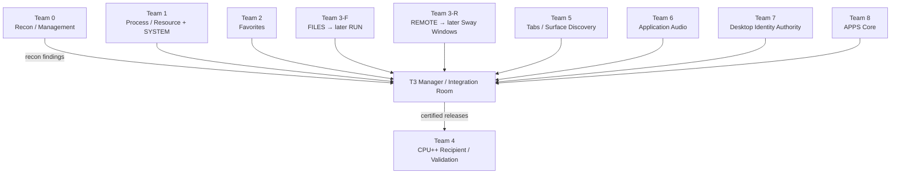
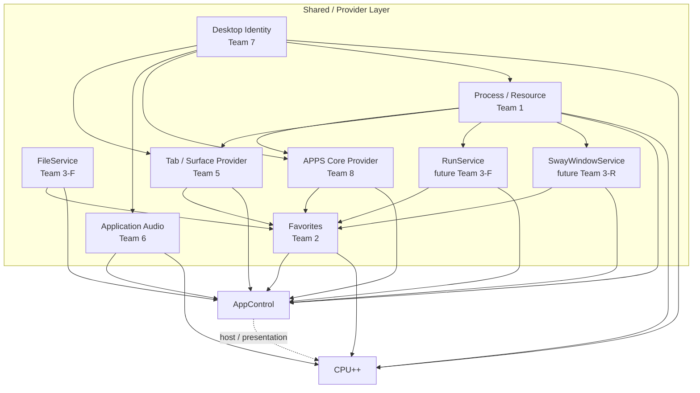
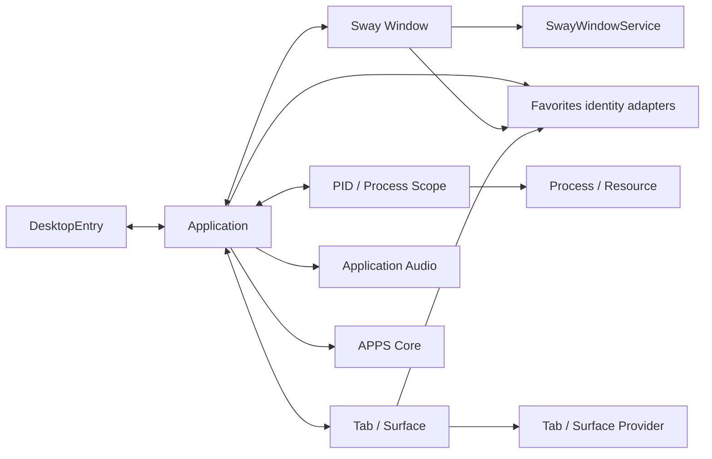
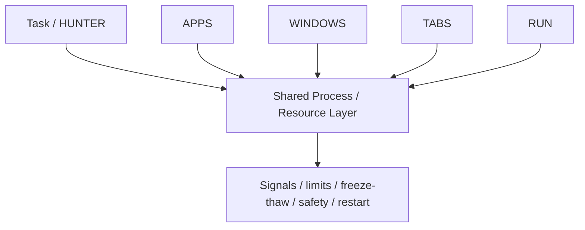
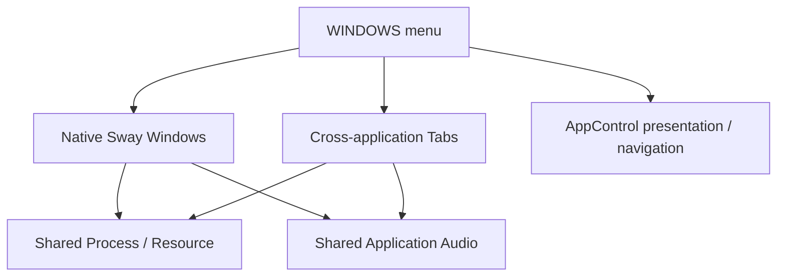
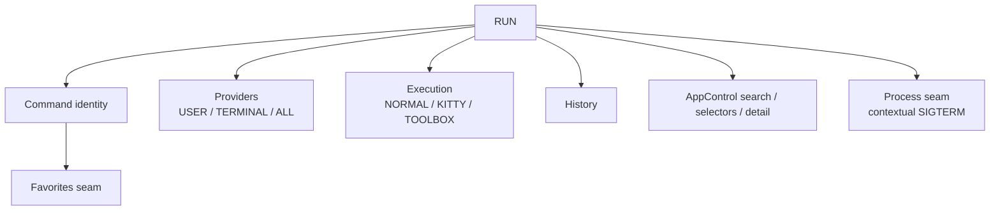
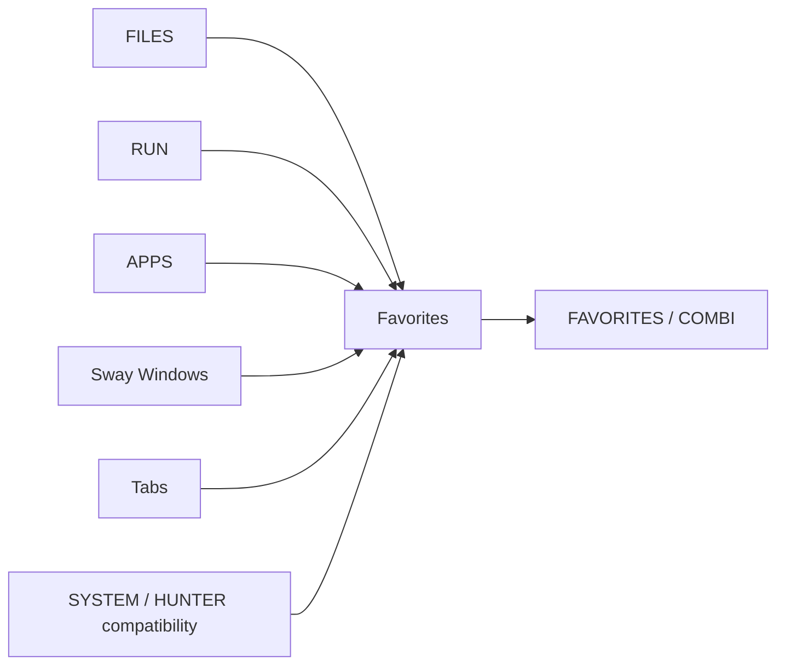
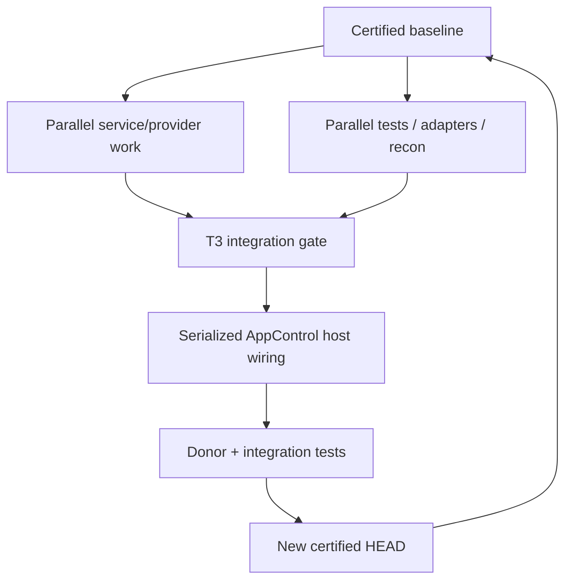

# Taskbars // Post-Apollo — Architecture Map

> Team 0 reconnaissance document.  
> This is an architecture / ownership graph, **not** GitHub's package Dependency Graph.
>
> Certified baseline for this map: `943d273` — fused AppControl + CPU++ patient.

## 1. Current hospital map



## 2. Shared-service architecture



The target direction is:

```text
OLD
AppControl owns state/services/control
        ↓
other UI reaches into AppControl

NEW
shared service/provider layer
        ↓
AppControl and CPU++ are peer consumers
```

A file is not considered a liberated organ merely because it lives outside
`AppControlW.qml`. It should have explicit dependencies and no hidden
AppControl back-reference.

## 3. Semantic identity authority



**Team 7 is the semantic identity authority.**

Teams 5, 6 and 8 may use temporary/local record keys while developing, but they
should not invent competing canonical application identity systems.

Teams 1 and 2 consume identity adapters/contracts rather than defining the
desktop identity model themselves.

## 4. Process / resource physiology



Domain UIs may own **intent and scope discovery**.

Examples:

- APPS: "these PIDs belong to this application"
- WINDOW: "these PIDs belong to this Sway window"
- RUN: "these PIDs match this command"
- HUNTER: "operate on this ranked process set"

The shared Process / Resource layer should own reusable destructive/control
operations instead of each UI implementing its own backend.

## 5. WINDOWS is not one organ



Future WINDOWS work should be split around real ownership boundaries:

- `SwayWindowService` for native Sway discovery/actions.
- Tab / Surface Discovery for cross-application tabs.
- Team 1 for shared process/resource physiology.
- Team 6 for shared application audio.
- AppControl retains host presentation/navigation until a later host-shell wave.

Do **not** recreate a giant `WindowController.qml` that simply becomes another
AppControl.

## 6. RUN is comparatively coherent



Likely future boundary:

```text
RunService
├── command identity
├── session history
├── terminal-history provider
├── PATH command catalog
├── execution strategies
└── records/state
```

Cross-team seams:

- semantic/persistent provider identity → Team 2 adapter consumption
- contextual process mutation → Team 1 shared Process / Resource backend

## 7. Favorites is an aggregation layer



Important distinction:

```text
favoriteable
can produce a favorite key

≠

reconstructable
Favorites can rebuild a first-class provider record
```

Known product requirement: FILES should eventually reconstruct into
FAVORITES/COMBI. Its previous absence is unfinished behavior, not an intended
restriction.

The first persistence extraction must preserve existing JSON and
`favoriteKeys` semantics, including the current Favorites → HUNTER protection
contract.

## 8. Integration traffic law



### Parallel-safe work

- new service files
- provider implementation
- tests
- adapters
- contracts/docs
- identity mapping
- reconnaissance
- dependency mapping

### Serialized through T3 Manager

- `AppControlW.qml` rewiring
- donor-block removal
- shared navigation changes
- generic result routing
- generic detail routing
- shared selector changes
- service-lifetime integration

Before a team enters serialized host tissue it should report:

```text
branch
base SHA
current HEAD
files changed
shared vessels discovered
AppControlW touched: YES/NO
tests
local pass
ready for integration
```

## 9. Team responsibilities

| Team | Current responsibility | Key boundary |
|---|---|---|
| Team 0 | Recon / management | No surgery |
| Team 1 | Process / Resource + SYSTEM | Build for HUNTER, APPS, WINDOWS, TABS, RUN |
| Team 2 | Favorites persistence/reconstruction | Preserve JSON + `favoriteKeys` compatibility first |
| Team 3-F | FILES | FileService; later likely RUN |
| Team 3-R | REMOTE | AppControl wiring after FILES; later likely Sway windows |
| Team 4 | CPU++ recipient / validation | Consume released organs; do not extract from AppControl |
| Team 5 | Tabs / Surface Discovery | Do not invent canonical app identity |
| Team 6 | Application Audio | Identity comes from Team 7 |
| Team 7 | Desktop Identity | Semantic identity authority |
| Team 8 | APPS Core | No mass APPS extraction until shared organs are removed |
| T3 Manager | Integration / certification | Own serialized host-integration queue |

## 10. Checkpoint model

Individual rooms checkpoint their own work:

```text
CHECKPOINT 0 — anatomy / ownership
CHECKPOINT 1 — cut plan
CHECKPOINT 2 — isolated service/provider exists
CHECKPOINT 3 — local liberation / ready for integration
```

T3 has a separate integration checkpoint before shared host changes enter the
certified patient.

Passes are distinct:

```text
LOCAL PASS
team branch works by itself

DONOR PASS
AppControl still behaves correctly

INTEGRATION PASS
work coexists with the other released organs and exposes a clean contract
```

## 11. How to use this document

This graph is maintained by Team 0 as reconnaissance evolves.

It should answer:

1. Who owns this capability?
2. Who consumes it?
3. Is it a shared organ or only a UI grouping?
4. Does it depend on semantic desktop identity?
5. Does it cross the Process / Resource layer?
6. Does it cross Favorites reconstruction?
7. Can the team work in parallel, or has it reached T3's serialized host gate?

When the certified patient changes, update the baseline marker and revalidate any
anatomical assumptions that came from an older snapshot.
